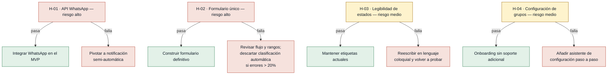

# Hipótesis y Experimentos — Discovery: Inscripción Oratorio Vacacional

Orden: mayor a menor riesgo. Lo que más puede tumbar el MVP se prueba primero.

---

### [H-01] Viabilidad de la API de WhatsApp Business — riesgo: alto

- **Supuesto a probar:** La API de WhatsApp Business puede ser configurada por el Oratorio con un número de teléfono dedicado, dentro de su presupuesto y sin requerir una verificación empresarial que un Oratorio no puede obtener.
- **Hipótesis:** Creemos que el Oratorio puede enviar mensajes automáticos de WhatsApp si configura una cuenta de WhatsApp Cloud API de Meta, porque Meta ofrece un nivel gratuito de hasta 1 000 conversaciones iniciadas por empresa al mes, suficiente para el volumen de inscripciones anual.
- **Señal medible:** Costo mensual real de la integración de WhatsApp y horas de configuración técnica hasta enviar un mensaje de prueba exitoso.
- **Criterio de éxito:** Configuración completada en ≤ 8 horas de trabajo técnico, costo mensual ≤ 20 USD y al menos 1 mensaje de prueba enviado y recibido exitosamente en un número controlado.
- **Experimento:** Spike de integración — crear una cuenta de prueba en Meta Business, vincular un número de teléfono dedicado a la WhatsApp Cloud API y enviar un mensaje de texto a un número controlado. Registrar tiempo invertido y costo real del plan.
- **Caja de tiempo/costo:** Máximo 8 horas de trabajo técnico; sin costo adicional si se usa el nivel gratuito de Meta (primeras 1 000 conversaciones al mes).
- **Regla de decisión:** Si pasa → incluir la integración WhatsApp como parte del MVP técnico y documentar el proceso de configuración para el equipo. Si falla (costo > 20 USD/mes, verificación empresarial no disponible para el Oratorio, o fallo al enviar el mensaje de prueba) → pivotar a notificaciones semi-automáticas: el sistema prepara el mensaje con el enlace correcto y el coordinador lo envía manualmente desde su teléfono; eliminar la automatización completa del alcance del MVP.

---

### [H-02] El formulario único elimina errores y reduce tiempo de inscripción — riesgo: alto

- **Supuesto a probar:** Un formulario único con clasificación automática por edad reduce los errores de asignación de grupo a cero y acorta el tiempo de inscripción de una familia respecto al proceso actual con múltiples formularios de Google Forms.
- **Hipótesis:** Creemos que el receptor completará la inscripción de una familia (1 representante, 1 niño) en ≤ 5 minutos si usa el formulario único con clasificación automática, porque los múltiples formularios por edad son la causa principal del tiempo perdido en revisión manual y corrección de asignaciones incorrectas.
- **Señal medible:** Tiempo promedio de inscripción completa de una familia (representante + 1 niño + estado de pago inicial registrado) y número de errores de clasificación automática de grupo.
- **Criterio de éxito:** Tiempo promedio ≤ 5 minutos en al menos 8 de 10 inscripciones de prueba, y 0 errores de clasificación automática de grupo en esas 10 pruebas.
- **Experimento:** Prototipo funcional (o sesión Mago de Oz) del formulario único operado por el receptor con 10 familias reales o simuladas. Medir tiempo desde inicio hasta confirmación y verificar la asignación de grupo resultante en cada caso.
- **Caja de tiempo/costo:** Máximo 2 semanas para construir el prototipo (Typeform, formulario codificado simple o escenario Mago de Oz) + 1 sesión de prueba de 2 horas con el receptor.
- **Regla de decisión:** Si pasa → construir el formulario definitivo sobre la misma lógica de clasificación automática. Si falla (tiempo > 5 minutos en más de 3 de 10 casos, o errores de clasificación > 0 en más del 20 % de las pruebas) → revisar el flujo del formulario y la lógica de rangos de edad antes de seguir construyendo; descartar la clasificación automática si los errores no bajan del 20 % tras una segunda iteración.

---

### [H-03] El representante interpreta su estado de pago sin asistencia — riesgo: medio

- **Supuesto a probar:** Los representantes de familia entienden los estados de pago ("pendiente de verificación", "verificado") al consultar su inscripción desde el celular sin necesitar contactar al equipo del Oratorio para que les expliquen.
- **Hipótesis:** Creemos que al menos el 80 % de los representantes identificarán correctamente el significado de su estado de pago y sabrán qué acción tomar si se les muestra la vista móvil de estado de inscripción, porque los términos son suficientemente claros sin contexto adicional para este público.
- **Señal medible:** Porcentaje de representantes que identifican correctamente su estado de pago y describen la acción que tomarían, sin ayuda del facilitador, en una prueba con prototipo de la vista móvil.
- **Criterio de éxito:** Al menos 4 de 5 representantes (80 %) identifican correctamente el estado y la acción correspondiente en ≤ 30 segundos cada uno, sin recibir ninguna explicación previa.
- **Experimento:** Prueba de usabilidad con 5 representantes de familia — mostrar el prototipo de la vista de estado en sus propios celulares con distintos estados (pendiente, en verificación, verificado) y pedirles que describan en voz alta qué ven y qué harían. Registrar aciertos, errores y tiempo por participante.
- **Caja de tiempo/costo:** Máximo 3 días para preparar el prototipo (pantalla estática en Figma o HTML) + 1 día para coordinar y realizar las 5 sesiones de 15 minutos cada una.
- **Regla de decisión:** Si pasa → mantener los textos y etiquetas actuales de los estados en el diseño final. Si falla (menos del 80 % identifica correctamente o tarda más de 30 segundos) → reescribir las etiquetas en lenguaje coloquial (p. ej. "Tu pago está siendo revisado" en lugar de "Pendiente de verificación") y realizar una segunda prueba con 5 representantes distintos antes de publicar.

---

### [H-04] El coordinador configura los grupos sin soporte técnico — riesgo: medio

- **Supuesto a probar:** El coordinador puede actualizar los rangos de edad y grupos en el sistema antes del período de inscripción sin necesidad de soporte técnico externo, y lo hará dentro de un plazo razonable.
- **Hipótesis:** Creemos que el coordinador completará la configuración de grupos (rangos de edad y nombres) en ≤ 2 días desde su primer acceso al sistema si este muestra una alerta de configuración pendiente al ingresar, porque el coordinador ya realiza esta planificación manualmente al inicio de cada año y solo necesita trasladarla al sistema.
- **Señal medible:** Días entre el primer acceso del coordinador al sistema y la primera configuración de grupos guardada y aplicada exitosamente.
- **Criterio de éxito:** El coordinador completa la configuración en ≤ 2 días calendario desde su primer acceso, medido en la primera sesión de uso real antes de abrir inscripciones.
- **Experimento:** Walkthrough con el coordinador — darle acceso al sistema o prototipo en staging con la configuración del año anterior cargada y pedirle que actualice los grupos para el nuevo período sin asistencia técnica. Registrar si lo completa, cuánto tarda y qué dudas expresa.
- **Caja de tiempo/costo:** Máximo 1 sesión de 1 hora con el coordinador usando el prototipo de configuración.
- **Regla de decisión:** Si pasa → incluir la configuración de grupos como parte del onboarding sin soporte adicional y documentar el flujo. Si falla (el coordinador no puede completarlo sin ayuda o tarda más de 2 días) → añadir un asistente de configuración paso a paso en el sistema y evaluar si el soporte técnico debe pre-cargar la configuración de grupos antes de abrir cada período de inscripciones.
