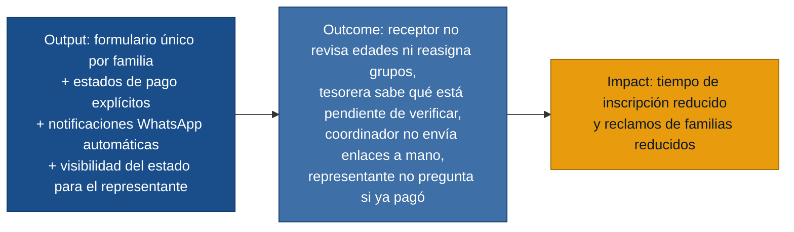

# MVP Canvas — Sistema de Inscripción Oratorio Vacacional

## Cadena de valor

---

| Bloque | Contenido |
|---|---|
| **Propuesta de valor** | Reemplazar el proceso de múltiples formularios por edad (Google Forms) por un sistema único que registra a la familia una sola vez, clasifica automáticamente a cada niño en su grupo, gestiona los estados de pago con claridad, notifica al representante por WhatsApp en el momento correcto y le permite ver el estado de su inscripción sin tener que consultar al equipo. |
| **Segmento de usuarios** | Cuatro roles con evidencia de primera mano: **Receptor de Inscripciones** (opera el formulario), **Coordinador del Oratorio** (gestiona grupos y envío de enlaces), **Tesorera del Oratorio** (verifica pagos y emite comprobantes), **Representante de familia** (llena el formulario, paga y recibe confirmación). El valor se realiza solo si el flujo completo —desde el registro hasta la confirmación al representante— funciona de extremo a extremo. |
| **Funcionalidades mínimas** | **Inscripción:** 1. Formulario único por familia: datos del representante una vez + agregar hijos con clasificación automática por fecha de nacimiento. · 2. Observación de salud opcional por niño (alergias u otras condiciones). · 3. Carga de documentos marcable como pendiente sin bloquear el proceso. · **Pagos:** 4. Estados de pago: pendiente / pendiente de verificación / verificado / rechazado. · 5. Registro de pago en efectivo: monto, fecha, responsable. · 6. Verificación de transferencias: comprobante adjunto, confirmación con registro de quién verificó. · **Notificaciones:** 7. Envío automático del enlace de WhatsApp del grupo al confirmar el pago. · 8. Mensaje diferenciado por niño cuando hay varios en grupos distintos. · 9. Comprobante de inscripción por WhatsApp con estado de pago explícito. · **Seguimiento:** 10. Panel para coordinador y receptor: niños por grupo, estado de pago, estado de documentos, enlace enviado. · 11. Vista de estado para el representante: estado de inscripción y pago desde el celular. · 12. Configuración de rangos de edad y grupos por el equipo administrativo. · 13. Búsqueda por nombre del niño o cédula del representante. |
| **Resultado esperado (outcome)** | Los cuatro roles operan sin consultas manuales entre sí: el receptor clasifica sin revisar edades, la tesorera tiene una cola clara de pagos por verificar, el coordinador no envía enlaces manualmente y el representante no necesita preguntar por WhatsApp si su inscripción quedó bien o si el pago fue confirmado. |
| **Métrica de éxito** | **Tiempo promedio de inscripción completa** (representante + 1 niño + confirmación de pago recibida) ≤ 50 % del tiempo medido con el proceso de Google Forms, evaluado en las primeras 30 inscripciones. Si esta métrica baja, el equipo puede decidir cuántas familias atender por turno — esa es una decisión de negocio real. Métrica secundaria: número de consultas manuales por WhatsApp al equipo sobre estado de pago en los primeros 3 días de inscripción, comparado con el proceso anterior. |
| **Riesgos / supuestos** | 1. **(ALTO)** La integración con WhatsApp para envíos automáticos depende de una API (p. ej. WhatsApp Business API) con costos y un proceso de verificación de cuenta que no se ha evaluado. Si no se puede automatizar, el enlace deberá enviarse desde el sistema pero en forma manual o semimáual. · 2. **(MEDIO)** Los rangos de edad varían cada año: si la configuración no se actualiza antes de abrir las inscripciones, la clasificación automática producirá grupos incorrectos. · 3. **(BAJO)** El formulario móvil para el representante asume que la UX es suficientemente simple para ser completado sin asistencia; validado cualitativamente en la entrevista pero no probado con un prototipo real. |
| **Fuera de alcance (por ahora)** | — Reportes estadísticos o exportación a Excel (útil después, no bloquea el valor del MVP). · — Gestión de cupos por grupo o lista de espera (no mencionada como dolor en ninguna entrevista). · — Portal de autoservicio completo para que el padre haga toda la inscripción en línea sin asistencia del receptor (requiere UX más profunda y un flujo de pago en línea; por ahora el receptor opera el formulario). · — Integración con canales distintos de WhatsApp (email, SMS) — sin evidencia de necesidad. · — Historial multi-año de inscripciones — no mencionado como dolor en este discovery. · — Módulo de comunicados generales al grupo (más allá del enlace inicial de WhatsApp). |

---

## Estado de la evidencia

Todas las personas primarias tienen entrevista de primera mano:

| Persona | Entrevista | Respaldo |
|---|---|---|
| Receptor de Inscripciones | `receptor-inscripciones.md` | primera mano |
| Coordinador del Oratorio | `coordinador-oratorio.md` | primera mano |
| Tesorera del Oratorio | `tesorera-oratorio.md` | primera mano |
| Representante de familia | `representante-familia.md` | primera mano |

El gate de readiness no tiene razones de evidencia para bloquear. El riesgo técnico pendiente es la integración con WhatsApp (supuesto de mayor riesgo) — debe ser la primera hipótesis a probar en `/discovery:experiments`.
