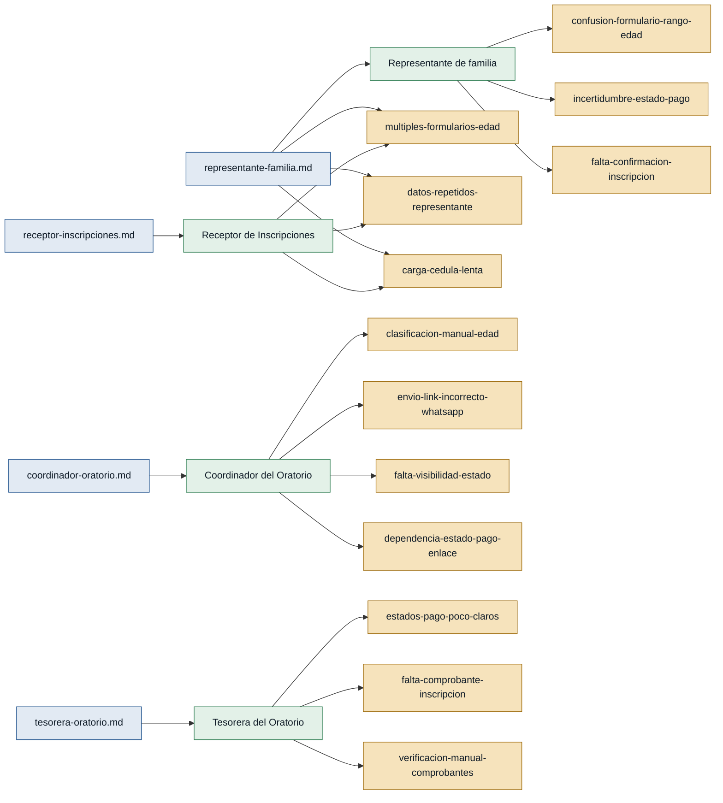

# Personas y Stakeholders — Discovery: Inscripción Oratorio Vacacional

## Personas

### Receptor de Inscripciones — receptor de inscripciones

- **Contexto:** Encargado de recibir y registrar los datos de las familias y niños durante el proceso de inscripción al Oratorio Vacacional.
- **Objetivo principal:** Registrar inscripciones de forma ordenada, con los datos del representante y sus hijos claramente vinculados, sin errores manuales.
- **Dolores:**
  - Tener un link diferente por cada grupo de edad genera confusión en los padres y revisión manual posterior. (`receptor-inscripciones.md`)
  - Padres que llenan el formulario equivocado obligan a correcciones manuales. (`receptor-inscripciones.md`)
  - Al inscribir varios hijos de la misma familia, los datos del representante se repiten generando inconsistencias. (`receptor-inscripciones.md`)
  - La carga de cédulas desde computadora genera cuellos de botella cuando hay varias familias esperando. (`receptor-inscripciones.md`)
  - Con alta demanda de familias, el proceso manual se desordena. (`receptor-inscripciones.md`)
- **Respaldo:** `primera mano` — entrevista propia: `receptor-inscripciones.md`

---

### Coordinador del Oratorio Vacacional — coordinador del oratorio

- **Contexto:** Responsable de organizar los grupos por edad, asegurar la correcta clasificación de cada niño y coordinar los grupos de WhatsApp de cada grupo.
- **Objetivo principal:** Que cada niño quede automáticamente asignado a su grupo y que el enlace de WhatsApp llegue al representante correcto en el momento oportuno.
- **Dolores:**
  - La clasificación manual de niños por grupo de edad (con múltiples formularios) genera errores de asignación. (`coordinador-oratorio.md`)
  - Enviar el enlace de WhatsApp equivocado genera confusión en las familias. (`coordinador-oratorio.md`)
  - Revisar edades, pasar nombres a grupos y enviar enlaces consume tiempo del coordinador. (`coordinador-oratorio.md`)
  - No tiene visibilidad del estado de pago, documentos y envío de enlace de cada niño en un solo lugar. (`coordinador-oratorio.md`)
  - Debe preguntar manualmente a Tesorería si ya se verificó el pago antes de enviar el enlace. (`coordinador-oratorio.md`)
- **Respaldo:** `primera mano` — entrevista propia: `coordinador-oratorio.md`

---

### Tesorera del Oratorio Vacacional — tesorera del oratorio

- **Contexto:** Responsable de revisar y verificar los pagos (efectivo y transferencia), gestionar comprobantes y mantener actualizado el estado de pago de cada familia inscrita.
- **Objetivo principal:** Controlar con claridad quién pagó, en qué estado está cada pago, y emitir comprobantes que den certeza tanto al Oratorio como a las familias.
- **Dolores:**
  - El proceso actual no diferencia claramente entre pago pendiente, comprobante enviado y pago verificado. (`tesorera-oratorio.md`)
  - Confundir pago enviado con pago verificado puede llevar a enviar información antes de tiempo. (`tesorera-oratorio.md`)
  - Las familias no reciben un comprobante claro de inscripción, lo que genera reclamos. (`tesorera-oratorio.md`)
  - No hay una forma estructurada de registrar quién verificó una transferencia, cuándo y con qué resultado. (`tesorera-oratorio.md`)
- **Respaldo:** `primera mano` — entrevista propia: `tesorera-oratorio.md`

---

### Representante Legal / Padre de Familia — representante de familia

- **Contexto:** Padre o tutor que inscribe a uno o más niños en el Oratorio Vacacional, completa el formulario, realiza el pago y recibe comunicación por WhatsApp.
- **Objetivo principal:** Inscribir a sus hijos rápido, desde el celular, sin repetir datos, y recibir una confirmación clara del estado de la inscripción y del pago.
- **Dolores:**
  - No siempre sabe qué formulario escoger según la edad del niño, especialmente si está cerca de cambiar de rango. (`representante-familia.md`)
  - Debe repetir sus datos (nombre, cédula, teléfono, dirección) por cada hijo inscrito. (`representante-familia.md`, `receptor-inscripciones.md`)
  - La carga de documentos (cédula) desde el celular a la computadora retrasa el proceso cuando hay fila. (`representante-familia.md`, `receptor-inscripciones.md`)
  - No sabe si el comprobante de transferencia fue revisado y debe preguntar manualmente por WhatsApp. (`representante-familia.md`)
  - Al finalizar la inscripción, no recibe confirmación clara de que todo quedó registrado correctamente. (`representante-familia.md`)
- **Respaldo:** `primera mano` — entrevista propia: `representante-familia.md`

---

## Stakeholders

### Oratorio Vacacional (institución)

- **Interés en el sistema:** Que las inscripciones queden registradas de forma ordenada, los pagos sean verificables, los grupos se organicen sin errores y las familias reciban comunicación oportuna.
- **Fuente:** `receptor-inscripciones.md`, `coordinador-oratorio.md`, `tesorera-oratorio.md`, `representante-familia.md`

---

## Mapa de trazabilidad

