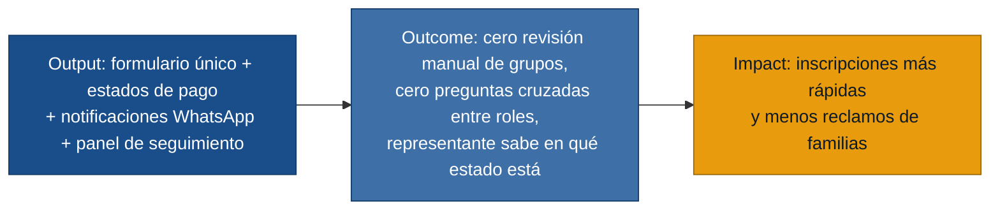

# User Stories — Discovery: Inscripción Oratorio Vacacional

Núcleo de valor: **formulario único por familia con clasificación automática → estados de pago claros → notificación oportuna al representante → visibilidad del estado para todos los roles**.

---

## 1. Inscripción por familia

- **[US-01]** Como Receptor de Inscripciones, quiero registrar primero al representante legal y luego agregar uno o más niños en la misma ficha, para no pedir los datos del representante más de una vez por familia.
  - Criterios de aceptación:
    - Dado que inicio una inscripción nueva, cuando ingreso los datos del representante (nombre, cédula, celular, dirección), entonces el sistema los guarda y habilita la sección de hijos sin volver a pedirlos.
    - Dado que agrego un segundo hijo de la misma familia, cuando lo registro, entonces queda vinculado automáticamente al representante ya ingresado.
  - Fuente: `receptor-inscripciones.md`, `representante-familia.md`

- **[US-02]** Como Receptor de Inscripciones, quiero que el sistema clasifique automáticamente al niño en el grupo correspondiente según la fecha de nacimiento o edad ingresada, para eliminar los formularios separados por edad y la revisión manual de clasificación.
  - Criterios de aceptación:
    - Dado que ingreso la fecha de nacimiento de un niño, cuando el sistema la recibe, entonces muestra el grupo asignado según los rangos configurados, sin que el receptor ni el padre tengan que elegirlo.
    - Dado que el padre ingresó una edad que está en el límite de dos rangos, cuando el sistema la evalúa, entonces aplica la regla del rango configurado sin ambigüedad y el resultado es visible antes de confirmar.
  - Fuente: `receptor-inscripciones.md`, `coordinador-oratorio.md`, `representante-familia.md`

- **[US-03]** Como Receptor de Inscripciones, quiero marcar un documento (cédula del niño o del representante) como pendiente sin bloquear la inscripción, para que el proceso avance aunque el documento no esté disponible en ese momento.
  - Criterios de aceptación:
    - Dado que la cédula no está disponible, cuando continúo con la inscripción, entonces el sistema la registra como pendiente sin impedir el avance ni generar un error.
    - Dado que hay documentos pendientes, cuando consulto la lista de inscripciones, entonces los pendientes son visibles para seguimiento posterior.
  - Fuente: `receptor-inscripciones.md`, `representante-familia.md`

- **[US-04]** Como Receptor de Inscripciones, quiero registrar una observación de salud (alergias u otras condiciones médicas) por cada niño inscrito, para que el equipo del Oratorio cuente con esa información durante las actividades.
  - Criterios de aceptación:
    - Dado que estoy completando los datos de un niño, cuando ingreso una observación de salud, entonces el sistema la guarda asociada a ese niño específico y queda visible en su ficha.
    - Dado que un niño no tiene observaciones, cuando completo su inscripción sin ese campo, entonces el sistema lo acepta sin requerir ese dato.
  - Fuente: `representante-familia.md`

---

## 2. Configuración y coordinación de grupos

- **[US-05]** Como Coordinador del Oratorio, quiero configurar los rangos de edad y los nombres de los grupos antes del período de inscripción, para que el sistema los use como base de clasificación automática.
  - Criterios de aceptación:
    - Dado que accedo a la configuración de grupos, cuando defino un rango (p. ej. 6–8 años → Grupo A), entonces el sistema lo aplica a todas las inscripciones nuevas desde ese momento.
    - Dado que modifico un rango, cuando guardo el cambio, entonces las inscripciones ya confirmadas no se ven afectadas; solo las nuevas aplican el nuevo rango.
  - Fuente: `coordinador-oratorio.md`

- **[US-06]** Como Coordinador del Oratorio, quiero ver un panel con todos los niños organizados por grupo, incluyendo estado de pago, estado de documentos y si ya se envió el enlace de WhatsApp, para dar seguimiento sin consultar a los otros roles.
  - Criterios de aceptación:
    - Dado que abro el panel de seguimiento, entonces veo por cada niño: nombre, grupo asignado, representante, número de WhatsApp, estado de pago, estado de documentos y si el enlace fue enviado.
    - Dado que un niño tiene un documento pendiente, entonces el panel lo indica visualmente en la misma fila, sin necesidad de abrir la ficha.
  - Fuente: `coordinador-oratorio.md`, `receptor-inscripciones.md`

---

## 3. Gestión de pagos

- **[US-07]** Como Tesorera del Oratorio, quiero que cada inscripción muestre un estado de pago claro (pendiente / pendiente de verificación / verificado / rechazado), para no confundir una transferencia enviada con una ya confirmada.
  - Criterios de aceptación:
    - Dado que se registra un pago por transferencia, cuando se guarda, entonces el estado inicial es "pendiente de verificación", no "verificado".
    - Dado que verifico el comprobante, cuando cambio el estado a "verificado", entonces el sistema registra quién hizo la verificación y en qué fecha y hora.
    - Dado que el comprobante no coincide, cuando lo marco como rechazado, entonces el sistema registra la observación y el estado queda diferenciado de los pendientes normales.
  - Fuente: `tesorera-oratorio.md`, `representante-familia.md`

- **[US-08]** Como Tesorera del Oratorio, quiero registrar un pago en efectivo indicando monto, fecha y quién lo recibió, para dejar constancia sin depender de anotaciones externas.
  - Criterios de aceptación:
    - Dado que selecciono "pago en efectivo" en una inscripción, cuando ingreso monto, fecha y responsable, entonces el sistema guarda esos datos y asigna el estado "verificado" directamente.
  - Fuente: `tesorera-oratorio.md`

- **[US-09]** Como Tesorera del Oratorio, quiero revisar el comprobante de una transferencia junto con los datos del representante y los niños inscritos, para confirmar la correspondencia antes de marcarla como verificada.
  - Criterios de aceptación:
    - Dado que abro una inscripción con estado "pendiente de verificación", entonces veo: nombre del representante, niños inscritos, monto declarado, fecha y el comprobante adjunto o imagen subida.
    - Dado que confirmo la transferencia, cuando guardo, entonces el estado cambia a "verificado" y queda registrado quién lo hizo.
  - Fuente: `tesorera-oratorio.md`

---

## 4. Notificaciones al representante

- **[US-10]** Como Coordinador del Oratorio, quiero que al verificarse el pago el sistema envíe automáticamente el enlace del grupo de WhatsApp correcto al representante, para eliminar el envío manual y el riesgo de enlace equivocado.
  - Criterios de aceptación:
    - Dado que el estado de pago de una inscripción pasa a "verificado", cuando el sistema lo detecta, entonces envía al número del representante el enlace del grupo de WhatsApp correspondiente al grupo de cada niño.
    - Dado que una familia tiene dos niños en grupos distintos, cuando se envía la notificación, entonces el mensaje especifica claramente qué niño va a qué grupo y envía el enlace correcto para cada uno.
  - Fuente: `coordinador-oratorio.md`, `tesorera-oratorio.md`, `representante-familia.md`

- **[US-11]** Como Tesorera del Oratorio, quiero que el sistema envíe un comprobante de inscripción por WhatsApp al representante al finalizar el registro, para reducir reclamos y dar certeza a la familia desde el primer momento.
  - Criterios de aceptación:
    - Dado que se completa el registro de una inscripción, cuando el sistema lo confirma, entonces envía al representante un comprobante por WhatsApp con: fecha, nombre(s) del/los niño(s), grupo(s) asignados, estado del pago y un código o número de inscripción.
    - Dado que el pago está pendiente de verificación al momento del registro, cuando se envía el comprobante, entonces indica explícitamente que el pago aún no ha sido confirmado.
  - Fuente: `tesorera-oratorio.md`, `representante-familia.md`

---

## 5. Visibilidad del estado para el representante

- **[US-12]** Como Representante de familia, quiero poder consultar el estado de mi inscripción y del pago (pendiente / en verificación / verificado) desde el celular, para no tener que preguntar por WhatsApp si ya revisaron el comprobante.
  - Criterios de aceptación:
    - Dado que accedo al estado de mi inscripción, entonces veo el estado actual del pago junto con los datos de los niños inscritos.
    - Dado que el estado cambia a "verificado", cuando consulto desde mi celular, entonces el estado actualizado es visible sin necesidad de contactar al equipo.
  - Fuente: `representante-familia.md`

---

## 6. Búsqueda y consulta

- **[US-13]** Como Receptor de Inscripciones, quiero buscar inscripciones por nombre del niño o por cédula del representante, para localizar rápido una ficha cuando hay muchas familias en proceso.
  - Criterios de aceptación:
    - Dado que ingreso un nombre parcial del niño, entonces el sistema muestra todas las inscripciones que coincidan con ese término.
    - Dado que ingreso la cédula del representante, entonces el sistema muestra la inscripción de ese representante con todos sus hijos vinculados.
  - Fuente: `receptor-inscripciones.md`
